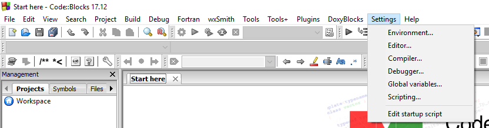
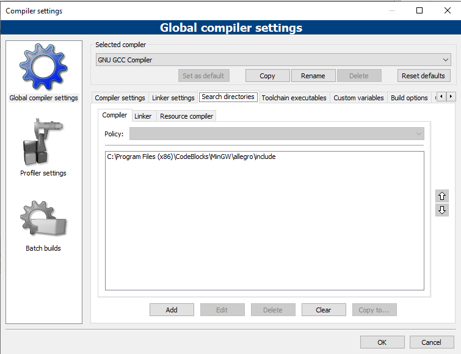
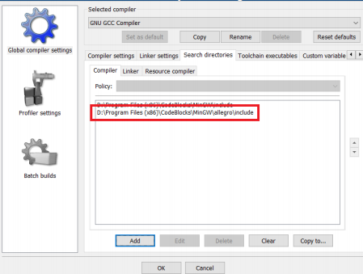
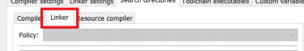
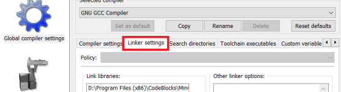
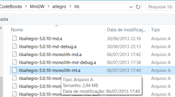

# ZombieLand - Documentação

Projeto final da disciplina de Introdução à Programação, do curso de Engenharia de Computação da UFPB.

Prof.: Lincoln David Nery e Silva.

Alunos:

<a href="https://github.com/hugo451">André Hugo</a>  
<a href="https://github.com/Isaac-CI">Isaac Nóbrega</a>  
<a href="https://github.com/lucasguedes778">Lucas Guedes</a>  
<a href="https://github.com/mayraamaral">Mayra Amaral</a>  
<a href="https://github.com/PhellipePalitot">Phellipe Palitot</a>  

## Introdução

 O jogo foi desenvolvido utilizando a biblioteca <a href="https://www.allegro.cc">Allegro 5</a>, que faz uso da linguagem C. A principal inspiração é o jogo do dinossauro do Google Chrome, que fica disponível no navegador na ausência de internet (<a href="https://tecnoblog.net/259202/origens-jogo-dinossauro-chrome/#targetText=Erro%20de%20conex%C3%A3o%2C%20que%20virou%20jogo%20(e%20procrastina%C3%A7%C3%A3o)&targetText=Tudo%20come%C3%A7ou%20com%20um%20projeto,70%2C%20chamada%20T%2DRex.">mais informações aqui</a>). 

 O jogo é do tipo <i>endless runner</i>, em que o personagem principal é um humano, num mundo
dominado por zumbis. Os zumbis estão vindo em sua direção e para continuar vivendo, é necessário pular e continuar correndo.

Ao iniciar o jogo, há o menu com três opções: Iniciar, Créditos e Sair. Essas três opções são lidas como flags que iniciam partes diferentes do código. 

Além de jogar com as teclas do teclado, é possível jogar usando um joystick via USB (essa função ainda não está totalmente otimizada, então é possível que ocorram <i>lags</i>). 

## Versões do jogo

* <strong>zombieland-v1</strong> - Primeira versão do jogo, sem o joystick.

* <strong> zombieland-v2</strong> - Segunda versão, com o joystick e com 2 players, porém sem otimizações e sem o menu personalizado.

* <strong>zombieland-v3-final</strong> - Terceira versão, com joystick e 1 player, otimizada.

## Getting Started

Para que seja possível jogar, é necessário instalar a IDE <a href="http://www.codeblocks.org/downloads">Code Blocks</a>. 

Depois de ter instalado o Code Blocks (ou se ele já estiver instalado), é hora de installar a biblioteca Allegro. Siga os passos: 

* Vá à parte de Files, no <a href="https://www.allegro.cc/files/">site da Allegro</a> e em Windows Binaries clique na versão mais recente do MinGW (compilador usado pelo Code Blocks). No momento em que este arquivo está sendo feito, a versão mais recente é a 4.7.0;

* Após ter baixado o arquivo .zip, descompacte e copie a pasta que foi gerada (Ctrl C);

* Vá até a pasta do Code Blocks nos arquivos de programas (geralmente é o caminho C:\Program Files (x86)\CodeBlocks);

* Entre na pasta MinGW e cole a pasta que você copiou anteriormente;

* Renomeie a pasta colada para "allegro" sem as aspas;

* Entre na pasta que acabou de ser renomeada;

* Agora entre na pasta include. Copie (Ctrl C) esse caminho (geralmente é C:\Program Files (x86)\CodeBlocks\MinGW\allegro\include);

* Abra o Code Blocks e clique em Settings, depois em Compiler, como mostra a imagem:

* Na nova janela aberta, vá em Search directories, depois em Compiler:

* Clique em Add;

* Cole o caminho que você copiou e confirme, como mostra a imagem:

* Feito isso, clique em Linker:

* Clique em Add e cole novamente o endereço da pasta allegro/include, como foi feito antes;

* Confirme;

* Depois disso, vá em Linker Settings (opção antes de Search directories):

* Clique em Add e navegue até a pasta em que o Allegro está (geralmente C:\Program Files (x86)\CodeBlocks\MinGW\allegro);

* Entre na pasta lib;

* Selecione o arquivo liballegro-5.X.X-monolith-mt.a (X.X vai depender da versão que foi instalada);

* Clique em OK.

Pronto, a biblioteca Allegro foi instalada.

Agora, para jogar, faça download das versões que se encontram nesse repositório e escolha com qual vai jogar. Recomendados a versão 3, que é a que se encontra com mais otimização e correção de <i>bugs</i>. Tendo escolhido a vesão, entre na pasta e execute o arquivo ".exe".

Também é possível ir no Code Blocks, ir em File > Open e abrir o arquivo .cbp do nosso projeto, que é ZombieLand.cbp. Feito isso é só compilar o código e jogar!

Agradecemos a sua atenção e desejamos que se divirta! 

## Créditos e Referências

* O guia para instalação da biblioteca Allegro foi adaptado <a href="https://aprendendoallegro.tk/allegro_install.pdf">daqui</a>;

* Os sprites usados no jogo foram retirados <a href="https://www.kenney.nl/assets/platformer-characters">deste site</a>.